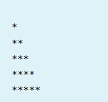
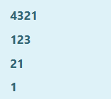
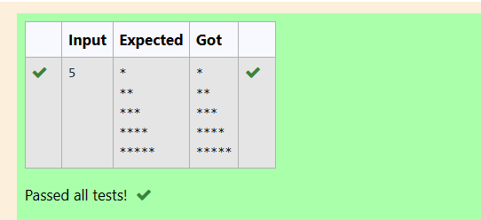
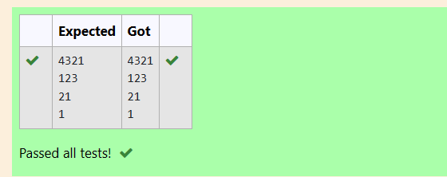

# EX2(B)Nested Loops
Developed by: ARSHITHA MS

Register number: 212223240015
 ## AIM:
 To write a program to print the given pattern

 
 
 ## ALGORITHM:
 1.Start the program

 2.Declare the variables

 3.Get input from the user.

 4.Use for loop with variables i for row and j for column.
 
 5.Print the output.

 6.End the program

 
 ## PROGRAM
 ### Program 1:
 ```
#include <stdio.h>
int main()
{
    int n,i,j;
    scanf("%d",&n);
    for (i=1;i<=n;i++)
    {
        for (j=1;j<=i;j++)
        {
            printf("*");
        }
        printf("\n");
    }
}
```
### Program 2:
```
#include <stdio.h>

int main() 
{
    int r=4,i,j,k;
    for(i=r;i>=1;i--)
    {
        if(i%2==0)
        k=i;
        else
        k=1;
        for(j=1;j<=i;j++)
        {
            printf("%d",k);
            if(i%2==0)
            {
                k--;
            }
            else
            {
                k++;
            }
        }
        printf("\n");
    }
}
```

## OUTPUT:
### Output 1:



### Output 2:


## RESULT:
Thus the program to print the given pattern is executed successfully.